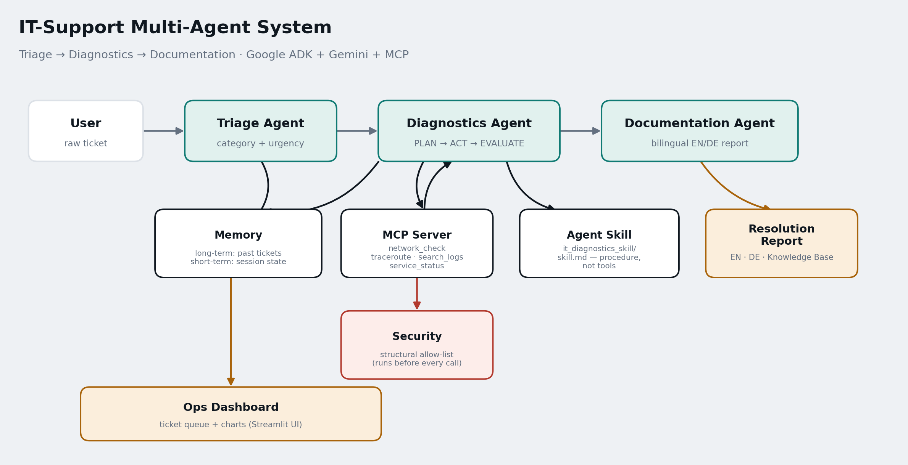

# IT-Support Multi-Agent System



A multi-agent system built with **Google ADK**, the **Gemini API**, and an **MCP server** that automates first-line IT support: triaging tickets, diagnosing technical issues, and generating a full bilingual (EN/DE) incident report — mirroring real-world tasks of an IT Systems Integration Specialist (Fachinformatiker Systemintegration).

Built as the capstone project for **Kaggle's 5-Day AI Agents: Intensive Vibe Coding Course With Google**.

**Track:** Agents for Business (an internal helpdesk automation with direct cost/time savings).

## Problem & Solution

First-line IT support is repetitive but high-stakes: the same categories of issues get triaged by hand, investigated manually, and documented inconsistently. This system takes a raw ticket and produces a full resolution — classification, root-cause diagnosis, and a bilingual incident report — with no human touching it until the final review.

## Architecture

Three agents run in a fixed `SequentialAgent` pipeline (Google ADK), passing results forward via session state (see diagram above):

1. **Triage Agent** classifies the ticket (network / hardware / software / access) and sets urgency.
2. **Diagnostics Agent** investigates using an explicit **Plan → Act → Evaluate loop**: it decides which single tool to try next, calls it via the MCP server, and only stops once it has a clear enough signal (or after 4 tool calls) - rather than following one fixed sequence of calls. It always checks long-term memory first for similar past tickets.
3. **Documentation Agent** turns the findings into a full incident report (see "Professional Report Format" below).

A structural security allow-list (`src/security.py`) runs before every diagnostic action, independent of what the model decides.

## Professional Report Format

Modeled on real ticketing-tool output (ServiceNow / Jira Service Management), not a one-line answer:

- Executive Summary
- Root Cause
- Diagnostic Timeline (the actual steps the Diagnostics Agent took)
- Actions Taken
- Recommended Next Steps
- Preventive Measures
- Zusammenfassung (Deutsch)
- Knowledge Base Entry

## Key Course Concepts Demonstrated

| Concept | Where |
|---|---|
| Agent / Multi-agent system (ADK) | `src/orchestrator.py` (`SequentialAgent` with 3 sub-agents) |
| MCP Server | `mcp_server/diagnostics_server.py` + connected in `src/agents/diagnostics_agent.py` via `MCPToolset` |
| Agent Skills | `skills/it_diagnostics_skill/skill.md` (procedural diagnostics playbook) |
| Security features | `src/security.py` (structural allow-list gating), wired into `src/tools/diagnostic_tools.py` |
| Memory | `src/memory.py` (long-term ticket recall, surfaced in the Ops Dashboard) + ADK session state (short-term, between agents) |
| Deployability | `streamlit_app.py` — a full web UI (ticket form + live agent stepper + Ops Dashboard with charts), deployable for free on Streamlit Community Cloud |

## The Web UI

`streamlit_app.py` gives this system a real interface instead of a terminal:

- **Submit a Ticket** — a form with example tickets, a live 3-step progress stepper (Triage/Diagnostics/Documentation), a scrollable live agent trace, and the final report in English / Deutsch / Knowledge Base tabs.
- **Ops Dashboard** — every ticket ever resolved, pulled from long-term memory: summary metrics, a category breakdown chart and an urgency breakdown chart (Plotly), and a full ticket queue with root cause/fix on demand. This is what makes the system look like an operational tool rather than a single chat exchange.

## Project Structure

```
it-support-agents/
├── src/
│   ├── agents/
│   │   ├── triage_agent.py
│   │   ├── diagnostics_agent.py       # Plan-Act-Evaluate loop, connects to MCP + memory
│   │   └── documentation_agent.py     # full incident report format
│   ├── tools/
│   │   └── diagnostic_tools.py        # underlying logic, wrapped by the MCP server
│   ├── security.py                    # allow-list gating (structural, not prompt-based)
│   ├── memory.py                      # long-term ticket store + dashboard data source
│   ├── pipeline.py                    # shared run logic for CLI + web UI
│   └── orchestrator.py
├── mcp_server/
│   └── diagnostics_server.py          # exposes diagnostic_tools.py over MCP (stdio)
├── skills/
│   └── it_diagnostics_skill/
│       ├── skill.md                   # procedural know-how for diagnostics
│       └── scripts/example_traces.md
├── examples/
│   ├── architecture_diagram.png       # cover image
│   └── sample_report_de.md
├── tools/
│   └── generate_diagram.py            # regenerates the architecture diagram
├── main.py                             # CLI entry point
├── streamlit_app.py                    # web UI entry point
├── requirements.txt
├── .env.example
└── README.md
```

## Setup

1. **Get a Gemini API key** from Google AI Studio: https://aistudio.google.com/apikey
2. Copy `.env.example` to `.env` and paste your key:
   ```
   GOOGLE_API_KEY=your_key_here
   ```
   Never commit `.env` or hardcode the key anywhere in the code (see `.gitignore`).
3. Install dependencies:
   ```bash
   pip install -r requirements.txt
   ```
4. Run the CLI demo (this launches the MCP server as a subprocess automatically):
   ```bash
   python main.py
   ```
   Or with a custom ticket:
   ```bash
   python main.py "My VPN keeps disconnecting every few minutes"
   ```
5. Or run the web UI instead:
   ```bash
   streamlit run streamlit_app.py
   ```
   This opens a browser tab with a ticket form and dashboard — no terminal interaction needed after that.

## Deploying the Web UI (free, no CMD needed for end users)

1. Push this whole folder to a **public GitHub repository**.
2. Go to https://share.streamlit.io → "New app" → select your repo/branch.
3. Set **Main file path** to `streamlit_app.py`.
4. In the app's **Settings → Secrets**, add:
   ```
   GOOGLE_API_KEY = "your_key_here"
   ```
5. Deploy. You'll get a public URL (e.g. `https://your-app.streamlit.app`) 

## Note on Google ADK / MCP SDK versions

This scaffold uses the Google ADK and MCP Python SDK API patterns as of early 2026 (`google.adk.agents.Agent`, `SequentialAgent`, `MCPToolset`, `StdioConnectionParams`, `mcp.server.fastmcp.FastMCP`). Both are actively evolving — if an import fails, check the latest docs (https://google.github.io/adk-docs/ and https://modelcontextprotocol.io/) and adjust import paths; this is expected and normal for fast-moving libraries.

